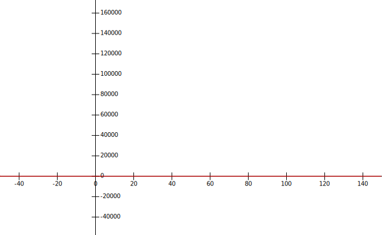

## Execution

Task 4.1 works by sending one char to the microcontroller and sending it back directly.  
By counting the received and the transmitted packages, one can calculate the error rate.

Execute [uart.py](uart.py) with `sudo python3 ./uart.py`

## Benchmarks

The maximal achived baudrate from my Raspberry Pi 3+ was *921600*. This results in *112, 5 kBs*.  
The given baud rates in the Task did not result in any error whatsoever.  
However, a error plot can be found in [error-rate.svg](error-rate.svg) .  
The bechmark was conducted by the [uart.py](uart.py) script. The microcontroller code is in [main.cpp](main.cpp) .

The reason for the error beyond *921600* baud could be the result of either the Pi or the Microcontroller is not able to provide such high speeds.  
Also different enviromental factors could impact the performance, such as nois and electro magnetic waves.  
For instance by bringing a strong magnet in close proximity to the Pi the error rate increased significantlly.

## Error Rate

